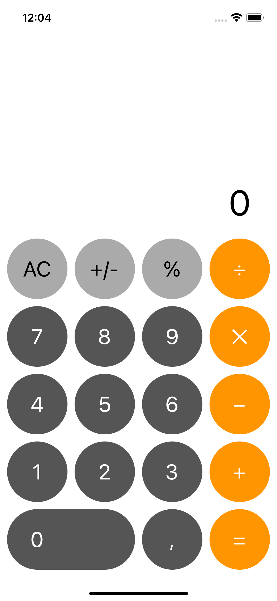

# Calculator
This is a simple calculator that I made when I was studying in TeachMeSkills

## About
- The interface is made using constrains
- User can use the same simple commands as in the iPhone calculator

## Light Mode

## Dark Mode

